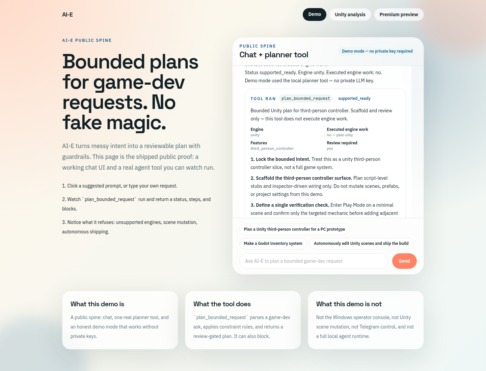

# AI-E

AI-E turns a messy game-development request into a **bounded, reviewable plan**. It is built to refuse fake completeness: unsupported engines, scene mutation, and autonomous "just ship it" asks are blocked in the open instead of guessed through.

This repository now has a **public spine** you can run in a browser: chat + one real agent tool. That is the demoable product surface. The Windows operator console and Unity sandbox runtime still exist locally; they are not what this public page claims to be.



## What the public demo does

The homepage is a chat UI backed by `plan_bounded_request`.

That tool is a local Constraint Router slice. It:

- parses a request for engine, platform, and feature
- applies safety rules (no scene mutation, no prefab editing, no build automation, no autonomous execution)
- returns a status, planned steps, missing inputs, and blocks
- **never executes engine work** (`executed: false` on every result)

Demo mode is the default. It works with no API keys. If `OPENAI_API_KEY` is set, the same local planner is still the tool that runs; the model is only used to decide when to call it.

### Recruiter click path

1. Open the deployed site (or `http://127.0.0.1:3000` locally).
2. Click **Plan a Unity third-person controller for a PC prototype**.
3. Confirm a tool card appears for `plan_bounded_request` with status `supported_ready` and `Executed engine work: no`.
4. Click **Make a Godot inventory system** and confirm an honest `unsupported_target` result.
5. Click **Autonomously edit Unity scenes and ship the build** and confirm a `blocked_unsafe` result.

The Unity issue-analysis form still lives at `/analyze`. It is a separate first-pass diagnosis surface, not the full local agent.

## Run locally

Requires Node.js 20+.

```bash
cd web
npm ci
npm run dev
```

Open [http://127.0.0.1:3000](http://127.0.0.1:3000).

Optional checks:

```bash
npm test
npm run lint
npm run build
```

### Environment variables

Copy `web/.env.example` to `web/.env.local`. Nothing in that file is required for demo mode.

| Variable | Required | What it does |
| --- | --- | --- |
| `OPENAI_API_KEY` | No | If set, chat may use a live model to call the planner tool. If unset, demo mode uses the local planner directly. |
| `AIE_FORCE_DEMO` | No | Set to `1` to keep demo mode even when a key is present. |
| `AIE_REASONING_MODEL` | No | Model name for live chat. Defaults to `gpt-4o-mini`. |
| `AIE_ANALYSIS_BACKEND_URL` | No | Optional hosted backend for the older `/analyze` route only. |

Do not commit `.env.local` or any secret key.

## Deploy

The public app is the Next.js project in `web/`.

### Vercel (recommended)

1. Import `SilverBomb-Gaming/AI-E`.
2. Set **Root Directory** to `web`.
3. Deploy with no env vars for demo mode, or add `OPENAI_API_KEY` for live chat.
4. After the first successful deploy, update the GitHub repo homepage from the old 404 URL (`https://ai-e-ten.vercel.app`) to the new Vercel URL.

Vercel Root Directory = `web`; Install/Build = defaults (`npm ci` / `next build`). `web/vercel.json` sets the framework to Next.js. There is no repository-root `vercel.json`.

This PR cannot finish the Vercel production deploy or rewrite GitHub homepage metadata without Vercel project access.

### Docker

```bash
docker build -t aie-web -f Dockerfile .
docker run --rm -p 3000:3000 aie-web
```

Or, from `web/`:

```bash
docker build -t aie-web .
docker run --rm -p 3000:3000 aie-web
```

## Architecture (plain language)

```
Browser chat
    -> /api/chat
        -> demo path (no key): local planner tool
        -> live path (optional key): model may call the same tool
    -> plan_bounded_request
        -> parse intent
        -> apply constraint rules
        -> return a review-gated plan (never executes Unity)

/analyze remains a separate Unity diagnosis form.
aie/ and app/ remain the local planner / operator / sandbox stack.
```

The public spine is intentionally thin. It reuses the existing `web/` Next.js app instead of inventing a parallel frontend.

## Honest scope

**Shipped here**

- Public chat UI
- One working tool: `plan_bounded_request`
- Demo mode with no private keys
- Optional live LLM path
- Deploy config for Vercel and Docker

**Not shipped here, and not claimed by the demo**

- Windows OpenClaw operator console (`python -m app.main`)
- Telegram command loop
- Unity / Babylon sandbox mutation
- Overnight autonomy, scheduling, or repo-wide agents

The older operator-console writeup is preserved at [docs/operator-console-status.md](docs/operator-console-status.md). Local desktop setup still expects Windows + Python 3.11 if you are running that stack, not the public web demo.

## Layout

- `web/` — public Next.js app (this demo)
- `web/lib/aie/spine/` — chat loop, demo/live mode, planner tool
- `aie/` — local Constraint Router and execution-policy code
- `app/` — Windows operator console
- `orchestrator_lane/` — local sandbox orchestration
