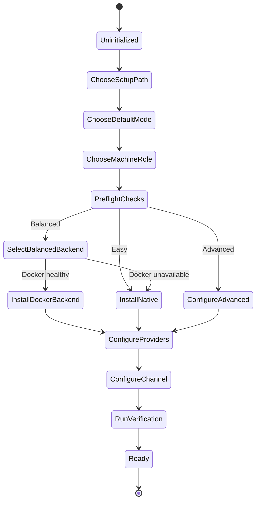
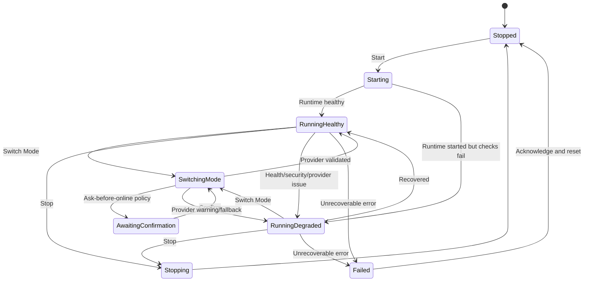

# OpenClaw Windows-First Agent Layer Plan

## Positioning

This plan defines a practical Windows-first local app and self-hosted agent layer around OpenClaw.

It is intentionally narrower than a full AI-E replacement:

- safe local operator surface first
- explicit Online Mode and Offline Mode switching
- useful for daily development work
- structured to reduce or avoid API cost through strong Offline Mode support
- portable by design to a later Linux laptop deployment without rewriting the architecture

## Executive Decision

### Recommended app stack

Use the existing Python desktop surface as the controller shell and build the OpenClaw layer behind it.

- Desktop shell: `PySide6`
- Controller/runtime orchestration: `Python`
- Managed runtimes: `Node 24` for OpenClaw, `Ollama`, optional `Docker Desktop + Compose v2`
- Secret storage: OS keyring abstraction backed by Windows Credential Manager now and Secret Service later
- Packaging: `PyInstaller` for the controller app, plus installer/bootstrap helpers for Node/OpenClaw/Ollama

### Why this stack

- The repo already has a working `PySide6` desktop surface under [`app/`](/E:/AI%20projects%202025/AI-E/app).
- A controller needs local process management, log streaming, key storage, health checks, and platform inspection more than web distribution.
- Reusing the current Python shell is lower risk than introducing Electron and redoing packaging, state, and OS integration.
- Python is a good control-plane language for launching `Node`, `Docker`, and `Ollama` processes while keeping platform adapters explicit.
- `PySide6` remains viable on Linux later, so this does not trap the project on Windows.

### Decision on Electron vs local web app

- Do not choose Electron for v1. It duplicates runtime concerns already handled well by the existing Python desktop shell and adds packaging weight.
- Do not lead with a browser-first local web app for v1. It still requires a privileged helper for process control and secret management, which means two layers instead of one.
- If a web UI is wanted later, expose a local-only internal API from the controller core and keep the same orchestration layer.

## Product Shape

The v1 product is a local controller application with three onboarding paths and two operating modes.

### Setup paths

- `Easy`
  - native Windows install path
  - minimal choices
  - Telegram-first success path
  - OpenAI and Ollama exposed as simple radio options
- `Balanced`
  - recommended default
  - prefers Docker-backed runtime when Docker is already healthy
  - falls back to native runtime when Docker is unavailable
  - includes profiles, verification tests, health/security checks, and clearer runtime control
- `Advanced`
  - keeps the same controller app, but exposes more routing, profile, and policy controls
  - explicitly separates runtime backend, provider profiles, and future extension seams

### Modes

- `Offline Mode`
  - provider class: `Ollama`
  - default recommendation for cost control and privacy
- `Online Mode`
  - provider class: `OpenAI`
  - explicit remote-use labeling and confirmation rules

### Policy settings

- `Always Offline`
- `Ask Before Online`
- `Always Online`

`Ask Before Online` should be the default for the Balanced path.

## Architecture Proposal

### Layer 1: Controller App

Responsibilities:

- onboarding
- dashboard
- quick actions
- confirmation dialogs
- log viewer
- profile editor
- mode badge and degraded-state messaging

This layer should stay thin. It renders state and dispatches commands into the application service.

### Layer 2: Application Service

Responsibilities:

- own the main state machine
- translate UI actions into orchestrated operations
- serialize commands so start/stop/switch actions do not race
- collect runtime/provider/health/security status into one dashboard model

This is the control-plane center of the system.

### Layer 3: Runtime Manager

Responsibilities:

- detect `Node`, `OpenClaw`, `Ollama`, and `Docker`
- install or bootstrap supported runtimes
- start and stop the selected OpenClaw backend
- watch process health
- collect logs
- enforce local bind defaults

Backends:

- `NativeOpenClawRuntime`
- `DockerOpenClawRuntime`

### Layer 4: Provider Adapter

Responsibilities:

- validate selected provider configuration
- report whether requests stay local or leave the machine
- surface model metadata for UI badges and warnings
- provide cost metadata for Online Mode

Adapters:

- `OpenAIProviderAdapter`
- `OllamaProviderAdapter`

### Layer 5: Policy Layer

Responsibilities:

- mode policy
- cost policy
- safety flags
- capability gating
- confirmation requirements

This layer decides what is allowed, not how a provider works.

### Layer 6: Platform Abstraction

Responsibilities:

- path conventions
- credential storage backend
- process detection helpers
- service and port inspection
- Docker detection

Implement this now with explicit interfaces so Windows-specific logic does not leak upward.

### Layer 7: Future Extension Seams

These should be interfaces in v1, not full features:

- scheduled task templates
- repo tooling hooks
- RAG/indexing adapter
- scraping adapter
- AI-E handoff adapter

## Recommended Repo Structure

Keep the existing `app/` package, but move new OpenClaw control work into a clearer subpackage rather than extending the current flat module layout forever.

```text
app/
  main.py
  ui/
    __init__.py
    launcher.py
    onboarding_view.py
    dashboard_view.py
    logs_view.py
    profile_view.py
    dialogs.py
  controller/
    __init__.py
    app_service.py
    commands.py
    state_machine.py
    models.py
    profile_store.py
    status_store.py
  runtime/
    __init__.py
    base.py
    openclaw_native.py
    openclaw_docker.py
    ollama_runtime.py
    docker_runtime.py
    node_runtime.py
    process_supervisor.py
    log_streams.py
    installers.py
  providers/
    __init__.py
    base.py
    openai_adapter.py
    ollama_adapter.py
    pricing.py
  policy/
    __init__.py
    mode_policy.py
    safety_policy.py
    cost_policy.py
    capability_flags.py
  platform/
    __init__.py
    base.py
    windows.py
    linux.py
    secrets.py
    filesystem.py
    networking.py
  diagnostics/
    __init__.py
    health_check.py
    security_check.py
    verification_suite.py
  assets/
    compose/
      balanced/
        docker-compose.yml
        openclaw.env.template
docs/
  architecture/
    openclaw_windows_agent_layer_plan.md
tests/
  controller/
  runtime/
  providers/
  diagnostics/
```

## Runtime Strategy

### Easy path

Use the native runtime path by default.

- detect or install `Node`
- install or connect to `OpenClaw`
- detect or install `Ollama`
- expose a minimal OpenAI setup screen
- default OpenClaw bind: `127.0.0.1`
- show Telegram setup as the first channel action

Reason: fastest path, lowest moving parts, easiest first success.

### Balanced path

Prefer Docker only when it clearly improves reproducibility and the machine already supports it.

Decision rule:

- if Docker Desktop is installed, running, and `docker compose` is healthy, use the Docker backend
- otherwise fall back to the native backend without blocking setup

Reason: Docker improves isolation, but it should not make first-run brittle.

### Advanced path

Expose backend choice directly:

- `Native`
- `Docker`

Also expose:

- multiple provider profiles
- future routing policy placeholders
- capability flags
- machine-role metadata

## Config Schema

Store non-secret state in versioned JSON.

Recommended deployed location:

- Windows: `%LOCALAPPDATA%/AI-E/OpenClawController/config.json`
- Linux later: `~/.config/ai-e/openclaw-controller/config.json`

Secrets are not stored in this file.

```json
{
  "schema_version": 1,
  "active_profile": "default",
  "profiles": {
    "default": {
      "setup_path": "balanced",
      "machine_role": "windows_local",
      "default_mode": "offline",
      "current_mode": "offline",
      "mode_policy": "ask_before_online",
      "runtime_backend": "docker",
      "workspace_root": "E:\\AI projects 2025\\AI-E",
      "openclaw": {
        "install_channel": "stable",
        "bind_host": "127.0.0.1",
        "bind_port": 3001,
        "data_dir": "C:\\Users\\<user>\\AppData\\Local\\AI-E\\OpenClawController\\data\\openclaw"
      },
      "providers": {
        "online": {
          "provider": "openai",
          "model_profile": "cheap",
          "model": "gpt-5-mini",
          "api_key_secret_ref": "aiec://secret/openai/default"
        },
        "offline": {
          "provider": "ollama",
          "base_url": "http://127.0.0.1:11434",
          "model_profile": "balanced",
          "model": "qwen2.5-coder:7b"
        }
      },
      "channels": {
        "telegram": {
          "enabled": false,
          "bot_token_secret_ref": "aiec://secret/telegram/default",
          "chat_id": "",
          "last_test_status": "never"
        }
      },
      "safety": {
        "allow_public_bind": false,
        "allow_recurring_automations": false,
        "allow_scraping": false,
        "allow_external_actions": false
      },
      "cost": {
        "show_estimates": true,
        "session_budget_usd": 5.0,
        "online_confirmation_threshold_usd": 1.0
      },
      "verification": {
        "last_health_check_at": null,
        "last_health_check_status": "unknown",
        "last_security_check_at": null,
        "last_security_check_status": "unknown"
      }
    }
  }
}
```

### Schema rules

- secrets are referenced, never embedded
- `bind_host` defaults to `127.0.0.1`
- recurring automations default to `false`
- capability flags default closed
- export/import must omit secrets and preserve only secret references
- `machine_role` exists in v1 even though only Windows is installable now

## Safe Secrets Strategy

Use an explicit `SecretStore` interface.

Methods:

- `put(secret_id, value)`
- `get(secret_id)`
- `delete(secret_id)`
- `describe(secret_id)`

Backends:

- Windows v1: Windows Credential Manager
- Linux later: Secret Service / libsecret-compatible keyring

Implementation notes:

- Prefer Python `keyring` or a thin platform-specific wrapper if stronger control is needed.
- Only store secret references in config.
- Inject secrets into child-process environment variables only at launch time.
- Do not materialize secrets into `.env` files on disk for v1.
- Redact secrets from logs and diagnostic bundles.
- Export/import should prompt the user to re-enter secrets after import if the target machine lacks matching entries.

## State Machine

### First-run setup state machine



### Runtime and mode-switch state machine



### Mode-switch rules

- Every mode switch must update a visible badge immediately: `Offline`, `Online`, or `Degraded`.
- If policy is `Ask Before Online`, switching from Offline to Online requires confirmation that the task will leave the machine.
- If Online credentials are missing, the switch is blocked with a direct remediation prompt.
- If the selected Ollama model is missing or clearly undersized, allow the switch but mark state `Degraded` with a warning.
- If the current mode becomes invalid while running, stop accepting new work until the provider state is clear again.

## Onboarding UX

### First screen

Required controls:

1. `Choose setup path`
   - Easy
   - Balanced
   - Advanced
2. `Choose default mode`
   - Offline
   - Online
3. `Select machine role`
   - Windows local
   - Linux local later

V1 behavior:

- `Windows local` is selectable
- `Linux local later` is visible but disabled with a note that the architecture is compatible and the launcher is deferred

### Main dashboard

Show at all times:

- runtime status
- current mode
- current provider/model
- local vs remote label
- channel status
- last health check
- last security check
- safety state
- quick actions

### Required quick actions

- `Start OpenClaw`
- `Stop OpenClaw`
- `Switch Mode`
- `Open Logs`
- `Run Health Check`
- `Run Security Check`
- `Test Telegram`
- `Change Provider`
- `Change Local Model`

### Important UX requirement

Every task-relevant screen must answer these questions without ambiguity:

- Is the system online or offline?
- Is the selected provider local or remote?
- Is the system healthy, degraded, or blocked?
- Is this action allowed by current policy?

## Offline Mode Design

Offline Mode is first-class, not fallback-only.

### Requirements

- discover local Ollama installation
- discover available local models
- recommend a default model preset by hardware class
- warn when the selected model is likely too weak for tool-heavy work
- persist preferred Offline Mode
- provide a local-only starter profile requiring no paid API key

### Hardware presets

Start with coarse presets instead of fake precision:

- `Low VRAM / CPU only`
  - recommend small instruct/coder models
  - warn about tool reliability and latency
- `Mid-range GPU`
  - recommend 7B to 14B class models
- `High-end GPU`
  - recommend larger reasoning-capable local models where practical

Implementation detail:

- keep the preset mapping in versioned metadata, not scattered UI code
- store recommendation confidence so the UI can say `recommended` vs `experimental`

## Online Mode Design

Online Mode must remain explicit and intentional.

### Requirements

- remote provider label always visible
- API key stored in OS-backed secret store
- per-session cost awareness notes
- confirmation gate before higher-cost or recurring-like operations
- local logs must show that a remote provider was used without leaking request content or secrets

### OpenAI provider profile model

Ship two named profiles first:

- `Cheap`
  - lower-cost default for routine cloud escalation
- `Strong`
  - better reasoning profile for harder tasks

Do not hard-code pricing logic into the UI. Keep pricing metadata in a provider table so it can be updated without rewriting policy code.

## Safety Model

### Network safety

- OpenClaw binds to `127.0.0.1` by default
- public bind is disabled unless the user explicitly enables it in Advanced settings
- if public bind is ever enabled later, warn that overlay/VPN access is preferred over raw public exposure

### Secrets safety

- no plaintext API keys in config files
- no plaintext Telegram bot tokens in config files
- no automatic `.env` file writes containing secrets

### Action safety

- recurring automations disabled by default
- scraping and external side effects behind capability flags
- high-impact actions require confirmation

### Diagnostic safety

- one-click health check
- one-click security check
- failures shown directly in the dashboard and logs viewer

### Trust-boundary clarity

Every provider badge must carry one of:

- `Local`
- `Remote`
- `Remote blocked by policy`

## Health Check and Security Check

### Health check contents

- detect Node version and whether it meets OpenClaw minimum
- detect OpenClaw runtime availability
- detect whether OpenClaw is running
- detect Ollama availability and local model presence
- detect Docker availability for Balanced/Advanced Docker backends
- validate selected provider profile
- validate Telegram setup state
- confirm controller can read logs and state directories

### Security check contents

- verify OpenClaw bind host is local-only
- verify recurring automations are disabled
- verify risky capability flags remain disabled
- verify secrets exist only as secret references in config
- verify runtime is not configured for raw public exposure
- verify log redaction is active

Both checks should return a structured result:

- `pass`
- `warn`
- `fail`

Each result row should include:

- id
- title
- severity
- remediation

## Controller Status Model

Use a single aggregated status object for the dashboard.

```json
{
  "runtime_status": "running",
  "health_state": "healthy",
  "safety_state": "safe",
  "mode": "offline",
  "provider_label": "Ollama / qwen2.5-coder:7b",
  "provider_location": "local",
  "channel_state": "telegram_not_configured",
  "last_health_check": "2026-04-06T17:00:00-04:00",
  "last_security_check": "2026-04-06T17:10:00-04:00",
  "degraded_reasons": []
}
```

This object should be the only source for dashboard summary badges.

## MVP Implementation Plan

### Milestone 1: Controller foundation

Build:

- new controller package structure
- versioned config/profile store
- aggregated dashboard status model
- onboarding skeleton for Easy/Balanced/Advanced plus mode selection

Definition of done:

- first-run flow persists a profile
- dashboard renders status from real config/state, not placeholders

### Milestone 2: Runtime management

Build:

- Node detection
- OpenClaw native runtime adapter
- Ollama detection
- start/stop controls
- log capture and viewer

Definition of done:

- Easy path can install or connect to native OpenClaw and Ollama
- controller can start and stop runtime reliably

### Milestone 3: Provider and mode switching

Build:

- OpenAI adapter
- Ollama adapter
- mode badge
- mode policy handling
- secure key storage abstraction

Definition of done:

- user can switch between Offline and Online modes
- `Ask Before Online` blocks cloud use until confirmed
- secrets are stored only via keyring-backed storage

### Milestone 4: Balanced path and diagnostics

Build:

- Docker backend detection
- Docker-backed OpenClaw runtime path
- health check
- security check
- one-click verification suite

Definition of done:

- Balanced path chooses Docker when healthy, native otherwise
- dashboard shows real health/security results

### Milestone 5: Daily-use readiness

Build:

- Telegram test flow
- profile export/import without secrets
- local model recommendations
- degraded-state warnings and remediation copy

Definition of done:

- a user can configure a practical daily-use profile and understand failures quickly

### Milestone 6: Linux-readiness seam

Build:

- platform adapter cleanup
- Linux path and keyring implementations behind interfaces
- portability review for assumptions embedded in UI and runtime code

Definition of done:

- controller core runs without Windows-only imports outside the platform layer
- remaining Linux work is launcher/packaging, not architectural surgery

## Milestone Breakdown by Priority

### Priority 1: Safety and operational reliability

- local-only bind enforcement
- secure secret store
- health/security checks
- clear degraded-state UX

### Priority 2: Cost control

- Offline Mode as first-class default
- mode policy controls
- local-only starter profile
- model suitability warnings

### Priority 3: Daily usefulness

- stable start/stop/runtime status
- logs viewer
- Telegram verification
- profile persistence

### Priority 4: Cross-platform readiness

- platform adapters
- machine-role metadata
- Linux-compatible path and secret abstractions

## Known Risks and Open Questions

- OpenClaw installation shape may change over time. Avoid deep coupling to undocumented file layouts and prefer launch adapters plus validation.
- Docker Desktop may not be available or desirable on every Windows machine. Balanced must degrade cleanly to native.
- Local model quality varies heavily by hardware. The UI must warn early instead of implying local models are equivalent to remote reasoning.
- Telegram setup still depends on bot-creation steps outside the app. The product should treat this as guided verification, not magical one-click provisioning.
- Secret-store behavior on future Linux laptops can vary by desktop environment. Keep the `SecretStore` contract strict so a fallback strategy can be added later if needed.
- Decide early whether the controller owns OpenClaw config generation or edits official config files in place. Owning a generated controller-managed config is safer.
- Confirm whether the existing AI-E app branding remains or whether this ships as a separate controller product. That affects packaging and first-run copy, not the architecture.

## Recommended Defaults

- setup path: `Balanced`
- default mode: `Offline`
- mode policy: `Ask Before Online`
- runtime backend: `Docker if healthy, else Native`
- default channel: `Telegram`
- default bind host: `127.0.0.1`
- recurring automations: `disabled`
- scraping/external capabilities: `disabled`

## Playtest and Verification Checklist

### Easy path

- Clean Windows machine without Docker can complete onboarding.
- OpenClaw installs or connects through the native path.
- Ollama installs or connects and a recommended starter model is selected.
- Dashboard shows `Offline`, `Local`, and a healthy or degraded reason.
- Telegram test returns a clear pass/fail result.

### Balanced path

- Machine with healthy Docker selects the Docker backend automatically.
- Machine without Docker falls back to native without a dead-end.
- Start, stop, and restart actions leave the dashboard in correct states.
- Logs viewer shows controller and runtime logs separately.

### Online Mode

- OpenAI key is written to the OS secret store, not config.
- Switching Offline -> Online under `Ask Before Online` requires confirmation.
- Dashboard visibly marks provider as `Remote`.
- Session cost note appears before the first online run.

### Offline Mode

- Local-only starter profile works with no paid API key.
- Missing Ollama model produces a degraded warning with remediation.
- Weak local model selection warns before tool-heavy workflows.

### Safety

- Security check fails if bind host is changed away from localhost.
- Security check fails if recurring automations are enabled in v1.
- Logs and exported profiles do not contain raw secrets.
- Remote provider use is always labeled in the UI.

### Portability seam

- No controller-core module imports Windows-only APIs directly.
- Platform-specific behavior is isolated under `app/platform/`.

## Final Recommendation

Build this as a Windows-first controller on top of the existing `PySide6` shell, not as a new Electron app.

The correct v1 is:

- local-first
- Offline-first
- Docker-capable but not Docker-dependent
- explicit about cloud usage
- strict about secrets and local-only binding
- structured for future Linux portability by interface, not by promise alone

That gives a stable developer tool now and a credible substrate for later AI-E-adjacent expansion without overbuilding autonomous features into v1.
